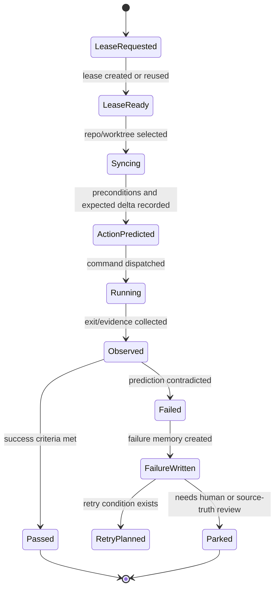

# Windburn <-> Crabbox Failure Hook

Status: design contract
Date: 2026-05-11
Scope: remote workhorse runs, Crabbox-style lease/sync/run/release loops,
Windburn cognitive cache writes

## Intent

Crabbox already models the remote workhorse loop well:

```text
lease machine -> sync dirty checkout -> run command -> collect evidence -> release
```

Windburn should not duplicate that control plane first. Windburn should wrap the
loop with cognitive state:

```text
predicted state -> action -> observed state -> failure/perception update -> next action changes
```

The target metric is simple:

```text
Did the agent avoid repeating a previously failed action under the same state?
```

## Non-Goals

- Do not import Crabbox provider credentials into Windburn.
- Do not let Windburn execute arbitrary remote shell fragments.
- Do not expose local hostnames, public IPs, SSH targets, raw env values, or
  private command logs in browser-safe surfaces.
- Do not auto-promote remote run findings into source truth.
- Do not replace Windburn's current remote-workhorse scripts in this slice.

## Minimum Hook Points

### 1. Lease Perception

When a workhorse lease is created or reused, Windburn records:

```ts
type LeasePerception = {
  kind: "lease_perception";
  provider: "crabbox" | "ssh" | "windburn-script";
  leaseId: string;
  runId?: string;
  repo: string;
  worktree?: string;
  class?: string;
  ttl?: string;
  privacy: "local-only" | "redacted-public";
  rawRef?: string;
  observedAt: string;
};
```

This is a perception, not a belief. It says what the tool reported.

### 2. Action Prediction

Before running the command, Windburn stores the prediction:

```ts
type ActionPrediction = {
  kind: "action_prediction";
  runId: string;
  action: string;
  expectedDelta: string;
  successCriteria: string[];
  preconditions: string[];
  beliefRefs: string[];
  failureRefs: string[];
  predictedAt: string;
};
```

This is the missing object in many current agents. Without it, failure cannot
teach the next attempt precisely.

### 3. Observed Delta

After command completion, Windburn stores the observed result:

```ts
type ObservedDelta = {
  kind: "observed_delta";
  runId: string;
  exitCode?: number;
  verdict: "PASS" | "FLAG" | "BLOCK";
  changedFiles?: string[];
  evidenceRefs: string[];
  redactedSummary: string;
  observedAt: string;
};
```

The evidence refs can point to Crabbox logs/events/artifacts or Windburn's own
preflight evidence files. Raw logs stay private unless explicitly sanitized.

### 4. Failure Memory

If prediction and observed delta disagree, Windburn writes a failure object:

```ts
type RemoteRunFailure = {
  kind: "remote_run_failure";
  runId: string;
  stateBefore: string;
  actionTried: string;
  predicted: string;
  actual: string;
  inferredReason: string;
  avoidRule: string;
  retryCondition?: string;
  evidenceRefs: string[];
  privacy: "local-only" | "redacted-public";
  createdAt: string;
};
```

The failure object should be retrieved before the next similar run. If the agent
does the same action anyway, the benchmark should score it as a regression.

## State Machine



## Routing Contract

Before a remote run, Windburn compiles:

```text
relevant failures
relevant beliefs
current perceptions
repo/source facts
operator constraints
```

The action policy may use failures as hard avoid hints:

```text
If same repo, same command, same observed precondition gap, do not rerun.
First satisfy retryCondition or ask operator.
```

It may not use failure memory to raise confidence or source-truth status.

## Example

```yaml
prediction:
  action: "run pnpm check:changed on leased runner"
  expected_delta: "changed-lane validation exits 0"
  preconditions:
    - "dependencies installed"
    - "repo synced"
    - "target package manager available"

actual:
  exit_code: 127
  verdict: FLAG
  observed_delta: "pnpm unavailable on runner"

failure:
  inferred_reason: "runner image lacks Corepack/pnpm hydration"
  avoid_rule: "do not rerun pnpm check:changed on this runner image before hydration"
  retry_condition: "run Actions hydration, devcontainer setup, or install Corepack/pnpm"
```

## Benchmark Metric

Metric name:

`no_repeat_failed_action`

Scoring:

- `1.0`: agent retrieves matching failure, changes action, and records why.
- `0.5`: agent retrieves failure but asks human instead of changing action.
- `0.0`: agent repeats same action under same failed preconditions.

Required evidence:

- prior failure object;
- new action prediction;
- observed action chosen;
- proof that precondition changed or action changed.

## First Implementation Slice

No Crabbox dependency is required for the first slice.

Use existing Windburn remote-workhorse scripts as the provider:

```text
scripts/remote-hermes-codex-smoke.sh
scripts/research-appliance-smoke.sh
scripts/remote-provider-smoke.sh
```

Wrap one script run with:

1. prediction markdown;
2. observed delta markdown;
3. failure object if mismatch;
4. next-run retrieval check.

After this works locally, map Crabbox `run_id`, `events`, `logs`, and
`artifacts` into the same object model.
